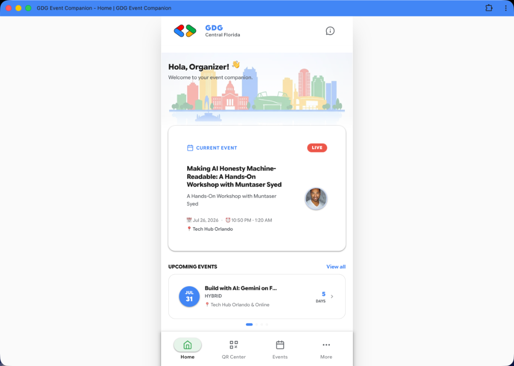
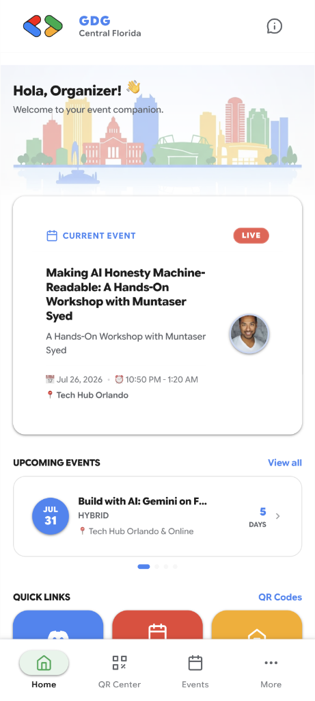
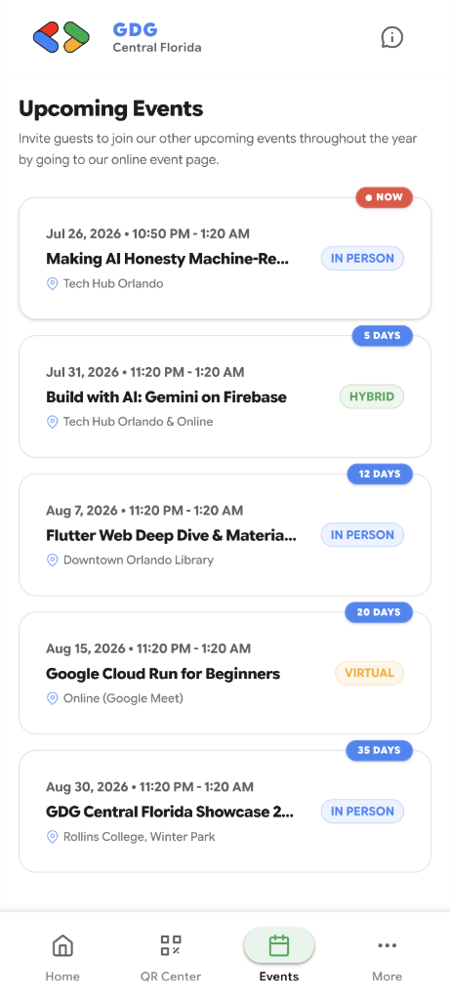
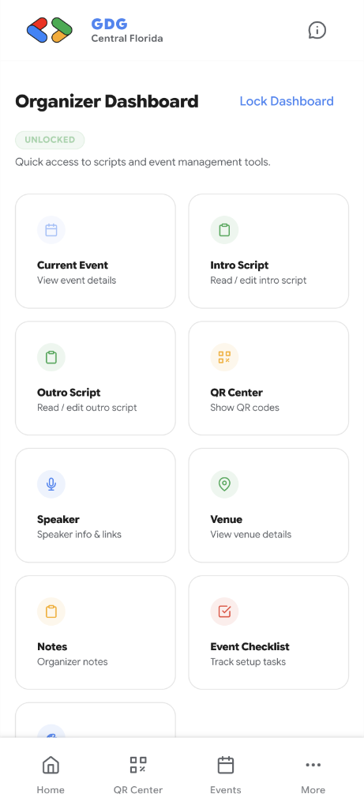

# GDG Event Companion


A modern, high-performance Progressive Web Application (PWA) built with [Astro](https://astro.build) and TypeScript to serve as an event companion for **Google Developer Groups (GDG)** community events, presenter scripts, schedules, and QR code tools.

---

## 📱 Preview & Screenshots

|                  Desktop View                   |               Mobile Experience               |
| :---------------------------------------------: | :-------------------------------------------: |
|  |  |

|                         Upcoming Events                         |                          Organizer Dashboard                           |
| :-------------------------------------------------------------: | :--------------------------------------------------------------------: |
|  |  |

---

## ✨ Features

- ⚡ **Progressive Web App (PWA)**:
  - Valid Web App Manifest (`site.webmanifest` & `manifest.json`).
  - Full Offline Support via Service Worker (`public/sw.js`) precaching and dynamic caching.
  - Installable on Android & Desktop Chrome/Edge with Richer PWA Install UI screenshots.
  - iPhone & iOS-friendly metadata (`apple-mobile-web-app-capable`, `apple-touch-icon`).
  - Dynamic `<meta name="theme-color">` synchronization matching active brand themes.
  - Material Design 3 Offline Fallback Page (`/offline`).

- 🎨 **Dynamic Theme Branding**:
  - Built-in community themes: **GDG Default**, **GDG DevFest**, **Build with AI**, **Google I/O Extended**, and **Holiday Celebration**.
  - **Custom Theme Creator**: Organizers can build custom color palettes with light/dark appearance modes and custom hex color controls.
  - Zero Flash of Un-themed Content (FOUC).

- 🎤 **Organizer Presenter Suite**:
  - **Intro & Outro Script Generators**: Read/Edit modes, HTML5 drag-and-drop section reordering, quick one-tap move buttons, section deletion, and inline undo banners.
  - **Markdown Formatting**: Full support for bold, italic, auto-prefixed URLs, tightly spaced bullet points, and an inline Markdown Shortcuts Guide modal.
  - **QR Code Projection Center**: One-tap QR code generator for chapter links, check-ins, and slides.

- 🔌 **Bevy API Integration**:
  - Dynamically fetches events for GDG chapters (e.g. Chapter `920` for GDG Central Florida).
  - Deep details fetching (RSVP counts, venue locations, virtual links, speaker metadata).
  - Client-side offline cache fallback when network connection is unavailable.

---

## 🚀 Project Structure

```text
/
├── public/
│   ├── icons/           # PWA icons (192x192, 512x512, maskable, apple-touch-icon)
│   ├── screenshots/     # Web App Manifest desktop & mobile preview screenshots
│   ├── images/          # Community branding assets & logo files
│   ├── site.webmanifest # PWA Web App Manifest configuration
│   ├── manifest.json    # Manifest alias for legacy compatibility
│   └── sw.js            # Service Worker with offline caching strategies
├── src/
│   ├── components/     # Material Design 3 reusable UI components
│   ├── config/         # Bevy API, themes, icons, and navigation links
│   ├── layouts/        # BaseLayout template with PWA metadata & theme scripts
│   ├── lib/            # Bevy API client, auth, and presenter script generator
│   └── pages/          # App routes (/events, /organizer, /qr, /more, /offline)
├── tsconfig.json       # TypeScript configuration
├── eslint.config.js    # ESLint flat configuration
└── package.json        # Project scripts and dependencies
```

---

## 🧞 Development Commands

All commands are run from the root of the project:

| Command                | Action                                       |
| :--------------------- | :------------------------------------------- |
| `npm install`          | Installs dependencies                        |
| `npm run dev`          | Starts local dev server at `localhost:4321`  |
| `npm run build`        | Builds static production bundle to `./dist/` |
| `npm run preview`      | Previews the production build locally        |
| `npm run lint`         | Lints code using ESLint                      |
| `npm run lint:fix`     | Automatically fixes ESLint warnings/errors   |
| `npm run format`       | Checks code formatting with Prettier         |
| `npm run format:write` | Formats all files with Prettier              |

---

## 🛠️ Tech Stack & Tooling

- **Framework**: [Astro v7](https://astro.build)
- **Styling**: Tailwind CSS & Vanilla CSS Design System
- **Language**: [TypeScript](https://www.typescriptlang.org) (Strict)
- **Linting & Formatting**: [ESLint](https://eslint.org) & [Prettier](https://prettier.io)
- **PWA**: Web App Manifest & Service Worker API

---

## Contact & Social Media

- Bluesky – [@code-vista.bsky.social](https://bsky.app/profile/code-vista.bsky.social)
- GitHub - [https://github.com/JavaVista/](https://github.com/JavaVista/)
- LinkedIn - [Javier Carrion](https://www.linkedin.com/in/technologic)
- Website - [techno-logic.us](https://www.techno-logic.us)

---

## 📄 License

This project is licensed under the MIT License - see the [LICENSE](LICENSE) file for details.
